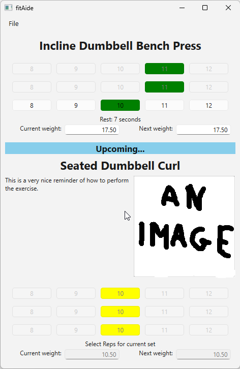

# fitAide

A minimalist workout logger built with Qt6 and SQLite for personal use.

Designed for simple home/garage gym sessions. The app guides you through your exercises one by one, with a clean rest timer and a preview of the next exercise during the final rest period.

## Features

- **First-run setup**: Prompts for database location, initial exercises, and workout settings.
- **Sequential workout flow**:
  - One exercise at a time with large heading, description, and optional image (paste from clipboard).
  - Rep selection via clickable buttons (configurable min/max reps).
  - Automatic rest timer between sets.
  - Preview of the next exercise appears during the final rest of the current one.
- **Weight tracking**:
  - Current weight is automatically carried over from the previous session's Next weight.
  - Next weight field — update it only when you decide to increase the load.
- **Settings**:
  - Number of sets (2–5)
  - Minimum and maximum reps per set
  - Rest time between sets (120–300 seconds)

Data is persisted in a local SQLite database (`fitAide.db` or `fitAideDev.db` in development mode).

## Screenshots

A workout is shown in progress, with the recently completed sets at the top, and information about the upcoming exercise below.

.

## Usage

1. Run the application.
2. On first launch, select or create your database file, then add your exercises and configure settings.
3. In a normal session:
   - Select reps for each set using the buttons.
   - The rest timer starts automatically after recording a set.
   - During the final rest, the next exercise preview appears.
   - After the final rest completes, the workout is saved and the app closes.

**Tip**: Only change the "Next weight" field at the end of a workout when you are ready to progress for the next session.

## Building and Running

The project uses **CMake** and requires the **SQLite3** and **Qt6** libraries. From the build directory:

```bash
cmake -B . -S ..\.. -DCMAKE_BUILD_TYPE=Release
cmake --build .
cmake --build . --target run
```

## License

This project is licensed under the **GNU General Public License v3.0** (GPL-3.0). See the `[LICENSE](LICENSE)` file for details.

## Future / Possible Improvements

- Warmup weight tracking
- BenchNotch / rack position support
- Notes field per exercise per workout
- Muscle group categorization
- Toggle exercises active/inactive
- Ability to add 1–2 extra sets mid-workout
- Workout review / history viewer (instead of immediate close after last exercise)
- Automatic weight progression suggestions
- Add audible countdown finale
- Show database/SQL errors in UI dialogs instead of only std::cerr

These are optional enhancements. The current version focuses on a simple, reliable logging flow for personal use.
